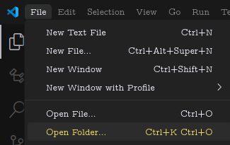

# C++ Beginners Guide

C++ is a powerful programming language that is widely used for system/software development, game development, and performance-critical applications. This repository contains resources and examples to help beginners learn C++.

This guide will help you set up your development environment and get started with C++ programming.

# Getting Started

Before we can start programming in C++, we need to install 5 things:

### 1. Package Manager (optional but recommended)

this is a tool that makes it easyer to install and manage software packages on your system. It automates the process of downloading, installing, and updating software.

### 2. C++ Compiler

A C++ compiler is a program that translates C++ code into machine code that can be executed by your computer. It is essential for compiling and running C++ programs.

### 3. Debugger

A debugger is a tool that helps you find and fix errors in your code. It allows you to step through your code, inspect variables, and understand the flow of execution.

### 4. Code Editor (VSCode recommended)

A code editor is a text editor specifically designed for writing and editing code. It provides features like syntax highlighting, code completion, and debugging support.

We will use Visual Studio Code (VSCode) as our code editor, which is a lightweight, yet powerful editor with excellent support for C++ development.

### 5. Version Control System (git recommended)

A version control system (VCS) is a tool that helps you manage changes to your code over time. It allows you to track changes, collaborate with others, and revert to previous versions if needed. 

We will use Git as our version control system.

### 6. CMake

CMake is a cross-platform build system that helps you manage the build process of your C++ projects. It generates platform-specific build files (like Makefiles or Visual Studio project files) based on a simple configuration file.

### 7. (Optional) Julia

Julia is a high-level, high-performance programming language for technical computing. It is optional but can be useful for scripting and automating tasks related to C++ development.


## Installation Guide

choose your operating system below to install the required tools for C++ development.

[Windows](./docs/Windows.md) | [MacOS/Unix](./docs/MacOS.md) | [Ubuntu/Debian](./docs/Debian.md) | [Fedora](./docs/Debian.md)


# Setting Up Visual Studio Code for C++

## Clone this repository

Clone this repository to the `<directory>` where you want to store your C++ projects:

```bash
git clone https://github.com/daniel-schwarzenbach/C++-for-Beginners.git <directory>
```

Then open up Visual Studio Code!

In the left-top corner click on File -> Open Folder and select the folder you just cloned.



the Folder you just opened now has the following structure:


## C++ Extension

Next we want to install the c++ extenstion for VSCode:

1. Go to the Extensions view by clicking the square icon on the sidebar or pressing `Ctrl+Shift+X`.
2. In the search bar, type C++.
3. Find the extension called C/C++ by Microsoft (it should have a blue icon with "C++" letters).
4. Click the Install button.

## Setting up the Debugger

In the .vscode file we can define setting and tasks.


Now you are ready for [Lesson 1](./lesson1/lesson1.md)