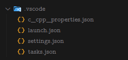
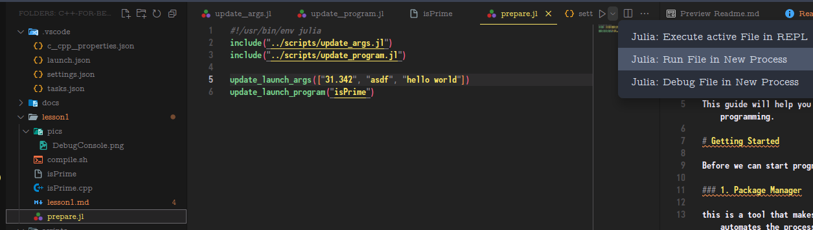
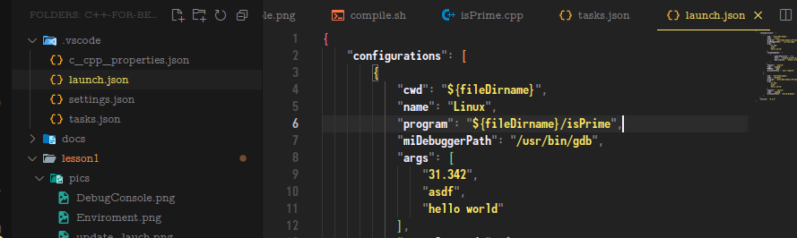
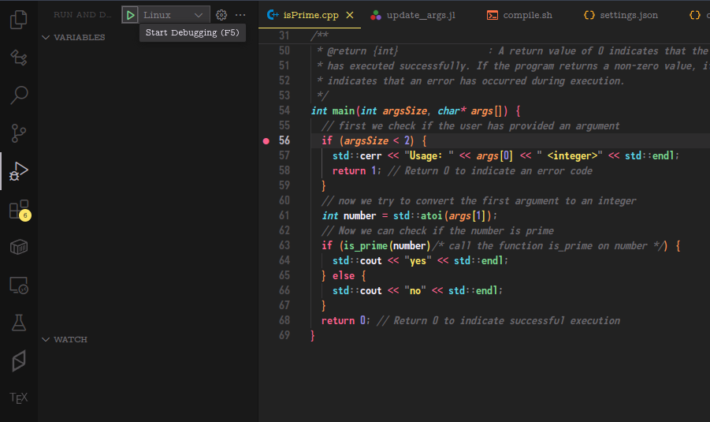
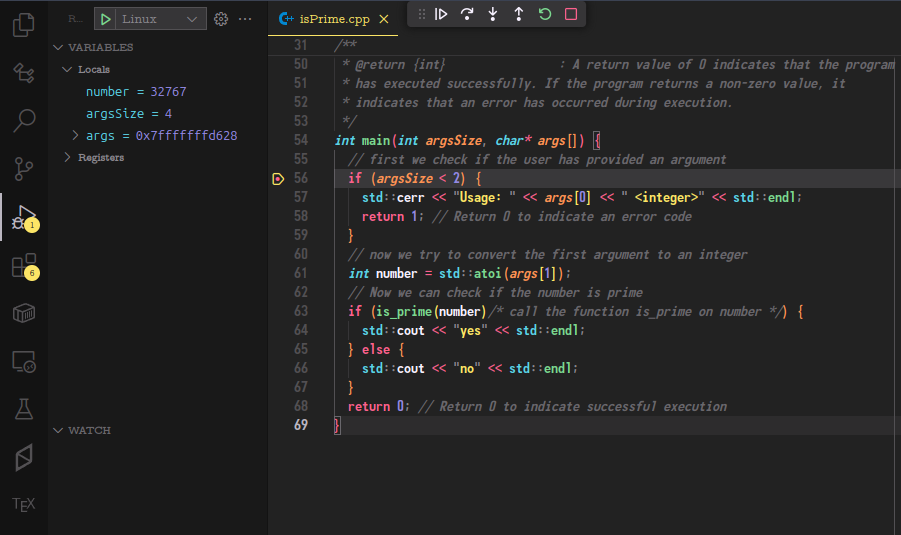
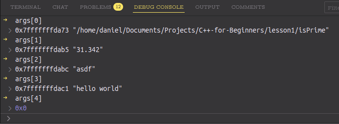

# Lesson 1: A simple C++ Program with VSCode

We will code an compile and debug a simple program that can tell us if a number is prime or not.


```bash
< ./isPrime 16
> no

< ./isPrime 31
> yes
```

the program is implemented in the file `lesson1/isPrime.cpp`

## VSCode Enviroment and Preparation

First of all we need to prepare our enviroment. The enviroment settings are stored in the folder `.vscode/'



To prepare the enviroment you can use the script by running it in the terminal or of VSCode.

```bash
julia ./lesson1/prepare_unix.jl
```



this will change the `launch.json` file to use the correct path to the executable and used arguments.




## Compiling && Debugging with VSCode

To compile and debug the program, we can use the pre-defined tasks and configurations in VSCode.

To do that select first the file `lesson1/isPrime.cpp` file so that VSCode sees it as the active file.

Then eighter hit F5 or push the green play button in the debug tab to compile and debug the program.

This will activate the launch task wich will first compile the program in a subtask and then run it in debug mode.

If youre running Windows or MacOs you have to change the launch target!



Now you can set breakpoints in the code by clicking in the left margin of the code window.
When you run it again it will stop at the breakpoints and you can inspect variables and step through the code.



You can use the debug console to inspect variables and execute commands mid program.




### Runnig the program manually

You can also compile it manually by typing `./lesson1/compile.sh` in the terminal. This will create the executable `lesson1/isPrime`.

We first have to compile the program before we can run it.

```bash
./lesson1/compile.sh
```

You can run the program in the terminal by typing `./lesson1/isPrime` and then entering a number.

```bash
./lesson1/isPrime 17
> yes
./lesson1/isPrime 18
> no
```